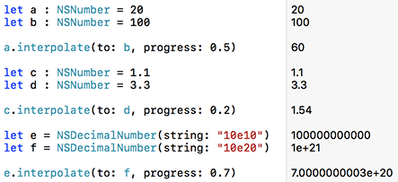
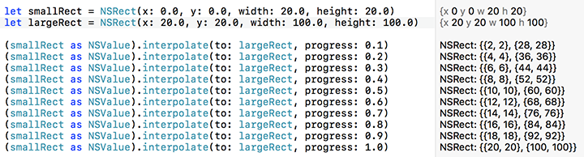
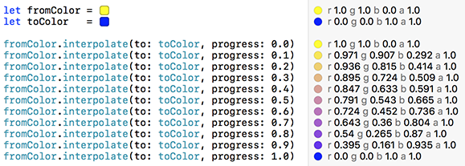

# LNInterpolation

An interpolation framework for Cocoa and Cocoa Touch.

[](https://github.com/LeoNatan/LNInterpolation/releases) <span class="badge-paypal"><a href="https://www.paypal.com/cgi-bin/webscr?cmd=_s-xclick&hosted_button_id=BR68NJEJXGWL6" title="Donate to this project using PayPal"></a></span>

[](https://github.com/LeoNatan/LNInterpolation/stargazers) [](https://raw.githubusercontent.com/LeoNatan/LNInterpolation/master/LICENSE) [](https://github.com/Carthage/Carthage)

[](https://github.com/LeoNatan/LNInterpolation/issues) [](https://github.com/LeoNatan/LNInterpolation/issues?q=is%3Aissue+is%3Aclosed) [](https://github.com/LeoNatan/LNInterpolation/graphs/contributors)

##Protocol

The framework defines a protocol, `LNInterpolable` (`Interpolable` in Swift), defining a common API for interpolating between two values.

The protocol defines two methods.

###Objective C

```objective-c
- (instancetype)interpolateToValue:(id)toValue progress:(double)progress;
- (instancetype)interpolateToValue:(id)toValue progress:(double)progress behavior:(LNInterpolationBehavior)behavior;
```

###Swift

```
public func interpolate(to toValue: Any, progress: Double) -> Self
public func interpolate(to toValue: Any, progress: Double, behavior: InterpolationBehavior) -> Self
```

The first variant returns an interpolated value between the original and `toValue` according to progress, using the default behavior.
The second is similar, but receives a behavior modifier. Each implementation can use this to choose how to implement the interpolation between the values. A default value of `LNInterpolationBehaviorUseDefault` (`.useDefault` in Swift) is always available.

##Provided Implementations

The framework provides implementation for the most common cases where interpolation may be needed.

###`NSValue` and `NSNumber`

An implementation is provided for `NSValue`, which provides support for the following values:

* Numbers (`NSNumber`)
	* Decimal numbers (`NSDecimalNumber`)
* Core Graphics: `CGPoint`, `CGSize`, `CGVector`, `CGRect`, `CGAffineTransform` (`NSValue`)
* UIKit: `UIOffset`, `UIEdgeInsets` (`NSValue`)
* AppKit: `NSEdgeInsets` (`NSValue`)




###`UIColor` and `NSColor`

An implementation is provided for colors (both for iOS and macOS). By default, color interpolation is performed in Lab colorspace for best possible interpolation quality. If performance is an issue, you may use `LNInterpolationBehaviorUseRGBColorSpace` (`.useRGBColorSpace` in Swift) to specify a behavior where RGB colorspace is used.



##Demo Playground

A demo playground is provided. Open LNInterpolationExample/LNInterpolationExample.xcworkspace and build the framework for macOS. Open the playground and explore the available pages.

##Adding to Your Project

###Carthage

Add the following to your Cartfile:

```github "LeoNatan/LNInterpolation"```

###Manual

Drag the `LNInterpolation.xcodeproj` project to your project, and add `LNInterpolation.framework` to **Embedded Binaries** in your project target's **General** tab. Xcode should sort everything else on its own.
